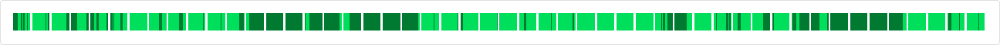

# Two-colored range

Two-colored range is data structure that efficiently stores and modifies data of a range where each point is colored in one of two possible colors. This project contains mutable and immutable two-colored range interfaces and an implementation based on ArrayList.

## Supported platforms and installation

While being a part of [Kotlin Multiplatform](https://kotlinlang.org/docs/multiplatform.html) project, the entire codebase of two-colored range is written in Kotlin Common and could be used on any supported platform. Currently the project provides artifacts for JVM, JS and MacOSX64 platforms. You can use [Maven Repository](https://mvnrepository.com/artifact/me.thorny) to locate artifact for required platform and find installation instructions.

## Documentation, test coverage and examples

The library is developed by following [test-driven development](https://en.wikipedia.org/wiki/Test-driven_development) principles, it is covered with tests and documentation by 100%. You can find example of using the library at [two-colored-range-visualizer](https://github.com/thorny-thorny/two-colored-range-visualizer). Visit [https://two-colored-range.thorny.me/](https://two-colored-range.thorny.me/) to see everything published online including the example or use gradle tasks:

- Documentation: `./gradlew dokkaHtml`
- Tests: `./gradlew allTests`
- Code coverage: `./gradlew koverHtmlReport`
